### `joel@github ~ $ ./hello.sh`

# Hi, I'm Joel Wolf.

**I turn real operational workflows into software people can rely on.**

From HR and cargo operations to church inventory and embedded media systems — I like the point where software leaves the demo and has to work in the real world.

  

 

### `joel@github ~ $ ./featured-projects.sh`

<table>
  <tr>
    <td width="33%" valign="top">
      <h3>CoreOps</h3>
      
<strong>HR + operations platform</strong>

      
A production system for Network Cargo covering employees, time and attendance, payroll, certificates, requests, documents, equipment, shifts, and cargo workflows.

      
<code>Next.js</code> <code>TypeScript</code> <code>PostgreSQL</code>

      Private · multi-tenant · role-based · PWA
    </td>
    <td width="33%" valign="top">
      <h3>BBG Lager</h3>
      
<strong>Inventory + item booking</strong>

      
A mobile-first inventory system for our church youth work: manage items and storage boxes, book equipment, detect conflicts, guide stocktakes, and see where everything lives.

      
<code>React</code> <code>TypeScript</code> <code>PocketBase</code>

      Private repository · deployed on Vercel
    </td>
    <td width="33%" valign="top">
      <h3>AudioCenter</h3>
      
<strong>Embedded church media hub</strong>

      
A kiosk-style system for finding and selecting church media, then delivering it to people through an attached USB drive or a time-limited QR download on their phone.

      
<code>Electron</code> <code>React</code> <code>Node.js</code> <code>Linux</code>

      Private · USB · QR transfer · local file index
    </td>
  </tr>
</table>

 

### `joel@github ~ $ ./contributions.sh`

 

### `joel@github ~ $ cat principles.txt`

`understand the workflow` · `design for the person using it` · `own the full stack` · `ship something useful`

 

TypeScript · React · Next.js · Electron · PostgreSQL · Prisma · Supabase · PocketBase · AWS · Docker · Linux

---

Build the workflow. Reduce the friction. Make the result useful.

