  <picture>
    <source media="(prefers-color-scheme: dark)" srcset="./assets/header-dark.svg">
    <source media="(prefers-color-scheme: light)" srcset="./assets/header-light.svg">
    
  </picture>

  

## Hi, I'm Joel

I build software around **real operational work**: people, inventory, media, documents, approvals, and the moments where a process must still work well on a phone.

My sweet spot is taking a messy workflow and turning it into a focused product — from data model and permissions to the interface people actually use.

## Current focus

I'm currently building practical web applications with **TypeScript, React, Next.js, PostgreSQL, and cloud infrastructure**, with a particular interest in mobile-first workflows and reliable business tools.

## How I build

- **Product first:** workflows and edge cases before feature counts
- **Full stack:** TypeScript, React, Next.js, PostgreSQL, Prisma, Supabase
- **Infrastructure:** Vercel, Cloudflare R2, AWS, Docker, Linux
- **Operational details:** role-based access, audit trails, PDFs, QR codes, resumable uploads, and mobile-first interfaces

  

## Selected projects

### CoreOps

An HR and operations platform developed for **Network Cargo**. It brings employee management, time tracking, documents, certificates, requests, equipment, and mobile workflows into one role-based system.

### [BBG Lager](https://github.com/joel-wlf/bbg-lager)

A mobile inventory and booking system for a youth camp — including item and box management, checkouts, conflict detection, guided stocktaking, and a visual shelf view.

### Scale Content Kit

A content-production workflow connecting clients, kits, shot lists, and media. It combines QR-based access, resumable uploads, internal review, notes, and organized delivery of production assets.

CoreOps and Scale Content Kit are private projects; their descriptions intentionally stay at product level.

---

Build the workflow. Reduce the friction. Make the result useful.

